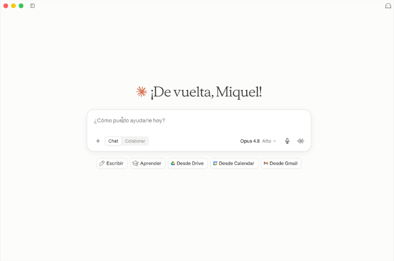

<!-- markdownlint-disable MD033 MD041 -->
<div align="center">

# 🏨 hospitality-mcp

**Talk to your hotel's PMS in plain language.**

An unofficial [Model Context Protocol](https://modelcontextprotocol.io) server
that connects hotel property-management systems to AI assistants like Claude —
starting with [Apaleo](https://apaleo.com).

[](https://github.com/Mik2503/hospitality-mcp/actions/workflows/ci.yml)
[](./LICENSE)
[](https://www.typescriptlang.org/)
[](https://modelcontextprotocol.io)
[](#-security)

</div>

> ⚠️ **Unofficial project.** This is an unofficial, community-built project. It
> is **not affiliated with, endorsed by, or supported by Apaleo**. "Apaleo" and
> related marks belong to their respective owners.

---

## What is this?

`hospitality-mcp` lets front-desk, revenue, and management users **ask and act
on their hotel data in natural language** from inside Claude — no PMS panel
required. Point it at your PMS, and questions like *"who arrives today?"* or
*"what's our RevPAR this week?"* are answered from live data.

It's built around a **PMS-neutral core** so the community can add more PMS
platforms as adapters. Apaleo is the first, chosen because it has the most open
developer experience in the industry: **free self-serve signup + a sandbox with
sample data**.

## 🚀 Try it in 5 minutes — no hotel required

Apaleo offers a **free developer account with a test environment full of sample
data**. Clone this repo, plug in free sandbox credentials, and you're querying a
realistic 5-hotel dataset in minutes — **without owning a hotel**. That's the
whole point.

<p align="center">
  
</p>

## ⚡ Zero-signup demo — try it in 30 seconds

Don't want to sign up for anything yet? Run it in **demo mode**: the server
serves **built-in synthetic sample data** — two fictional hotels, clearly marked
`(SAMPLE DATA)` — so you can see it work with **no account and no credentials**.

```bash
git clone https://github.com/Mik2503/hospitality-mcp.git
cd hospitality-mcp
npm install && npm run build
PMS_PROVIDER=demo node dist/index.js       # starts in read-only demo mode
```

To use it from Claude, point your MCP host at the server with `PMS_PROVIDER=demo`
in its environment (or put `PMS_PROVIDER=demo` in a local `.env`). Then ask
*"who arrives today?"* and you'll get answers from the demo hotel.

> Demo mode is **read-only** and the data is **not real** — the server logs a
> `DEMO MODE` banner and the hotels are named "(SAMPLE DATA)" so it's never
> mistaken for a live PMS. When you're ready for real data, switch to
> `PMS_PROVIDER=apaleo` (the default) and add your Apaleo credentials — see below.

## 💬 What you can ask

| Persona | Example prompts |
|---|---|
| **Front desk / ops** | *"Who checks in today at BER?"* · *"Show me tomorrow's departures."* · *"Any dirty rooms right now?"* |
| **Revenue / management** | *"What's occupancy, ADR and RevPAR for BER from Jul 11–18?"* · *"Compare this week's RevPAR to last week's."* |
| **Guest services** | *"Find the reservation for Lovelace."* · *"Pull up guest Angelo's history."* |

Claude decides which tools to call and chains them as needed (e.g. calling the
KPI tool twice to compare two periods).

## 🧰 Tools

**Read tools** (always available):

| Tool | What it does |
|---|---|
| `list_properties` | List accessible hotels with id, currency, time zone |
| `get_arrivals` | Reservations checking in on a date (default: today) |
| `get_departures` | Reservations checking out on a date (default: today) |
| `search_reservations` | Search by guest name, status, and/or date window |
| `get_reservation` | Full detail of one reservation |
| `get_availability` | Bookable units per room type for a date range |
| `get_guest` | Guest profile + reservation history |
| `get_occupancy_kpis` | Occupancy, ADR, RevPAR (states its methodology) |
| `get_housekeeping` | Housekeeping condition & occupancy of units |

**Write tools** — 🧪 **experimental, opt-in, off by default:**
`create_reservation`, `modify_reservation`, `cancel_reservation`.

> These are implemented against Apaleo's official API but **not yet validated
> against a live PMS**, so don't expect them to be polished. They are
> **disabled by default**; when enabled, each one requires an explicit
> confirmation and shows a preview first (see [Security](#-security)). Use with
> care. The server is **read-only out of the box.**

## ⚡ Quick start

```bash
git clone https://github.com/Mik2503/hospitality-mcp.git
cd hospitality-mcp
npm install
cp .env.example .env   # then add your Apaleo credentials (see below)
npm run build
```

### 1. Get free Apaleo credentials

1. **Sign up** for a free apaleo account at [apaleo.dev](https://apaleo.dev)
   (this also gives you the developer dashboard).
2. Open [app.apaleo.com/dashboard](https://app.apaleo.com/dashboard).
3. Go to **Apps → Connected apps → Add a new app → Add custom app**.
4. Fill in a **Client code** and **Client name**.
5. Under **Scopes**, grant the three read scopes this server uses:
   - `setup.read` — properties, unit groups, units, housekeeping status
   - `reservations.read` — reservations, arrivals, departures, guests, revenue
   - `availability.read` — availability and occupancy KPIs

   (Only add `reservations.manage` if you plan to enable the experimental
   writes — see below.)
6. Save, then copy the generated **Client ID** and **Client Secret**.
   > 🔒 Store the secret securely and never commit it. If it ever leaks, rotate
   > it in the dashboard (see [SECURITY.md](./SECURITY.md)).

### 2. Add your credentials

Paste them into your local `.env` (created from `.env.example`):

```dotenv
APALEO_CLIENT_ID=your_client_id_here
APALEO_CLIENT_SECRET=your_client_secret_here
```

### 3. Verify authentication

```bash
npm run verify:auth
```

Gets a token and makes one trivial read call. It prints **no** secrets or
tokens, and ends with `🎉 Apaleo authentication is working.`

### 4. Connect it to Claude

**Claude Desktop** — edit
`~/Library/Application Support/Claude/claude_desktop_config.json` (macOS) or the
equivalent on your OS:

```json
{
  "mcpServers": {
    "hospitality-mcp": {
      "command": "node",
      "args": ["/absolute/path/to/hospitality-mcp/dist/index.js"]
    }
  }
}
```

**Claude Code:**

```bash
claude mcp add hospitality-mcp -- node /absolute/path/to/hospitality-mcp/dist/index.js
```

Credentials are read from the project's `.env` automatically, so you don't need
to duplicate them in the host config. Restart Claude and ask *"Who arrives today
at BER?"*

## 🔒 Security

Trust is a feature. See [SECURITY.md](./SECURITY.md) for the full policy.

- **Local-only.** Runs on your machine over stdio. No intermediate server, no
  telemetry. Credentials and hotel data never leave your machine except to reach
  Apaleo directly.
- **Read-only by default.** Write tools are **not even registered** unless you
  set `APALEO_ENABLE_WRITES=true`.
- **Writes require confirmation.** Every write tool returns a **preview** and
  makes no change unless called again with `confirm: true`.
- **Least privilege.** Only read scopes are requested by default; the
  `reservations.manage` scope is requested only when writes are enabled.
- **No secret logging.** Credentials and tokens are never written to logs or
  error messages — they are redacted.

> Enabling writes makes the server request the `reservations.manage` scope. Your
> connected app must have it granted, or even login fails. Grant it first.

## 🧩 Architecture — add your PMS

Three layers keep it PMS-neutral:

1. **Normalized core** — neutral hotel types (`Reservation`, `Guest`,
   `Property`, `Availability`, `OccupancyKPIs`, …). No provider details leak in.
2. **`PMSAdapter` interface** — the contract every PMS implements.
3. **Adapters** — e.g. the Apaleo adapter maps its API to the normalized types.

Tools only ever call the normalized interface, so **adding a new PMS = writing
one adapter**, with zero changes to the tools. Want Mews, Cloudbeds, or your
own? See **[docs/ADD_AN_ADAPTER.md](./docs/ADD_AN_ADAPTER.md)**.

## 🗺️ Status & roadmap

- ✅ Demo mode — zero-signup synthetic data to try the server instantly.
- ✅ Apaleo read tools — validated against the live sandbox.
- 🧪 Apaleo write tools — implemented & gated, **not yet validated live**.
- 🧪 Mews read tools — validated against the public Mews demo. Availability &
  occupancy KPIs are not implemented yet for Mews (see [docs/TODO.md](./docs/TODO.md)).
- ⏳ More PMS adapters — contributions welcome.

Known assumptions being refined are tracked in [docs/TODO.md](./docs/TODO.md).

## 🤝 Contributing

Issues and PRs are welcome — especially **new PMS adapters** and live-validating
the write path. See **[CONTRIBUTING.md](./CONTRIBUTING.md)** to get started, and
please never include real credentials in issues, tests, or fixtures.

## 📄 License

[MIT](./LICENSE) © hospitality-mcp contributors

---

> **Reminder:** This is an **unofficial** project and is **not affiliated with,
> endorsed by, or supported by Apaleo**. "Apaleo" and related marks belong to
> their respective owners.
